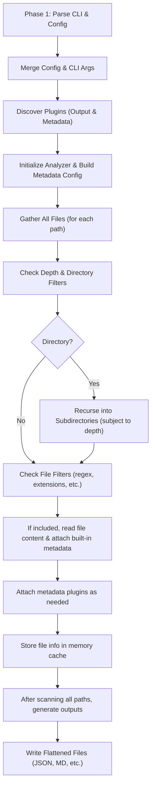

# SingleFile

SingleFile is a top-tier codebase **flattening** and **analysis** tool designed to unify all your project files into comprehensive, metadata-rich outputs. Whether you’re aiming to streamline code sharing with AI systems, produce elegant documentation, or develop custom analytics, SingleFile’s modular design can adapt to your workflow.

<br>

---
## Key Features
- **Cross-Platform**: Works seamlessly on Windows, macOS, and Linux.
- **Multiple Output Formats**: Built-in support for text (Default), Markdown, and JSON, with the option to create your own output plugins (HTML, CSV, or anything else).
- **Rich Metadata**: Choose from defaults like file size, modification timestamps, or line counts. Extend with MD5 checksums, base64-encoded binary data, or your own custom calculations.
- **Selective Inclusion/Exclusion**: Filter directories, file names, or file extensions with regex patterns for precise scanning.
- **Config-Driven**: Merge a JSON config file with CLI arguments—ideal for reproducible, team-shared workflows.
- **Two-Phase CLI**: Phase 1 loads global arguments (like `--config` and `--disable-plugin`), while Phase 2 merges your configurations and plugin-specific flags.
- **Error Handling**: Ignore problematic paths or fail early—your choice.

**No External Dependencies**  
SingleFile is proudly built using only the Python Standard Library—no additional third-party packages. This minimalistic approach ensures:
1. **Zero Hassle Installation**: No extra libraries to install or maintain.  
2. **Reduced Conflicts**: Fewer version and compatibility issues.  
3. **Portable and Lightweight**: Straightforward to run on any system with Python 3 installed.  

We believe in providing a lean, self-contained solution that’s easy to integrate into diverse environments.
<br>

---

## Table of Contents
- [Acknowledgments](#acknowledgments)
- [Installation](#installation)
  - [Linux/macOS](#linuxmacos)
  - [Windows](#windows)
  - [Using Pyenv](#using-pyenv)
- [Environment Variables](#environment-variables)
- [Basic Usage](#basic-usage)
- [Advanced Examples](#advanced-examples)
- [Plugin Architecture](#plugin-architecture)
  - [Output Plugins](#output-plugins)
  - [Metadata Plugins](#metadata-plugins)
- [Contributing & Development](#contributing--development)
- [License](#license)

<br>

---

## Acknowledgments

**Special thanks** to [@VictorHenrique317](https://github.com/VictorHenrique317) for his project [flatten-codebase](https://github.com/VictorHenrique317/flatten-codebase.git). SingleFile was originally inspired by flatten-codebase, and this collaboration of ideas helped propel our codebase forward.

<br>

---

## Installation

### Linux/macOS

1. **Clone the repository**:
   ```bash
   git clone https://github.com/chrisdreid/single_file.git
   cd single_file
   ```
2. **Install** in editable mode (recommended for development or plugin creation):
   ```bash
   pip install -e .
   ```
3. **Test** the installation:
   ```bash
   single_file --help
   ```
   or
   ```bash
   python -m single_file --help
   ```

### Windows

1. **Clone or download** the repository:
   ```powershell
   git clone https://github.com/chrisdreid/single_file.git
   cd single_file
   ```
2. **Install**:
   ```powershell
   pip install -e .
   ```
3. **Run**:
   ```powershell
   single_file --help
   ```
   If `single_file` isn’t recognized, verify your Python scripts directory is added to the `PATH`, or simply use `python -m single_file --help`.

### Using Pyenv
If you prefer isolating specific Python versions:

1. **Install** Python with [pyenv](https://github.com/pyenv/pyenv):
   ```bash
   pyenv install 3.10.5
   ```
2. **Activate** it:
   ```bash
   pyenv shell 3.10.5
   ```
3. **Install** SingleFile:
   ```bash
   pip install -e .
   ```

<br>

---

## Environment Variables

SingleFile looks for additional config files in any directories listed in `SINGLEFILE_CONFIG_PATH`. This variable is optional but can be helpful for storing shared config files in a common location.

- **macOS/Linux**:
  ```bash
  export SINGLEFILE_CONFIG_PATH="/home/myuser/singlefile_configs"
  ```
- **Windows (PowerShell)**:
  ```powershell
  $Env:SINGLEFILE_CONFIG_PATH = "C:\singlefile_configs"
  ```
- **Windows (cmd.exe)**:
  ```bat
  set SINGLEFILE_CONFIG_PATH=C:\singlefile_configs
  ```

To verify SingleFile sees your configs:
```bash
single_file --query configs
```

<br>

## VS Code Extension (Coming Soon)

We’re also gearing up to release a dedicated **Visual Studio Code extension** that deeply integrates SingleFile’s capabilities right into your editor workflow. Here’s what you can expect:

- **One-Click Flattening**: Quickly consolidate your current workspace with a single command.
- **Inline Configuration**: Set paths, formats, and metadata plugins directly from the VS Code interface.
- **Real-Time Feedback**: See notifications or error messages in the VS Code status bar/log, providing immediate feedback during the flatten or analysis process.
- **Convenient Output**: Automatically open or preview your flattened files without leaving the editor.

Stay tuned for announcements as we finalize the extension and make it available in the Visual Studio Marketplace!

---

## Basic Usage

Use SingleFile to flatten your codebase into a single or multiple outputs. Below is an illustrative example—tweak it to your preferences:

```bash
single_file \
  --paths /path/to/my_project \
  --formats default,json \
  --output-file my_flattened \
  --depth 2 \
  --ignore-errors \
  --exclude-dirs ".git" "__pycache__" \
  --extensions py md \
  --metadata-add md5 \
  --metadata-remove size modified
```

**What’s Happening**:
- Recursively scans `/path/to/my_project` up to two directory levels.
- Skips errors, meaning unreadable files or permission issues won’t stop the process.
- Produces two files: `my_flattened.txt` (default plugin) and `my_flattened.json` (JSON plugin).
- Includes only `.py` and `.md` files, ignoring `.git` and `__pycache__` directories.
- Attaches an `md5` field to each file’s metadata; excludes default `size` and `modified` fields.

<br>

## Filtering and Processing: Order of Operations
SingleFile ensures your directory paths, file filters, recursion depth, and metadata requirements are all accounted for before any outputs are generated. Below is a high-level overview showing how --paths, filtering options, and metadata additions operate within SingleFile:

---


### Description of Each Step
- Phase 1: Parse CLI & Config
- SingleFile first collects essential arguments like --config, --disable-plugin, and any initial flags (e.g., --paths, --depth) but doesn’t finalize them yet.
- Merge Config & CLI Args
- If a JSON config is provided (--config file.json), SingleFile merges those settings with any command-line overrides.
- Discover Plugins
- SingleFile scans the plugins/ directory, loading both Output Plugins and Metadata Plugins, except those disabled via --disable-plugin.
- Initialize Analyzer & Build Metadata Config
- Internal data structures are set up for scanning. SingleFile merges built-in metadata options with any discovered metadata plugins, factoring in --metadata-add and --metadata-remove.
- Gather All Files
- SingleFile iterates over each item in --paths, determining if it’s a file or directory.
- Check Depth & Directory Filters
- For directories, SingleFile checks recursion depth (against --depth) and directory-exclusion patterns (like --exclude-dirs, --include-dirs).
- If Directory
-  If the directory is included and depth allows, SingleFile recurses further into subdirectories.
- If File
- For files, SingleFile evaluates extension-based filters (--extensions, --exclude-extensions) and name-based patterns (--exclude-files, --include-files).
- Read File Content & Attach Built-in Metadata
- SingleFile reads file content (or skips if binary). Attaches basic metadata like file size, last modified time, etc., unless removed via CLI (--metadata-remove).
- Attach Metadata Plugins
- Each plugin that you’ve either enabled by default or with --metadata-add <plugin> runs and inserts extra data (e.g., MD5 hashes, base64-encoded binary data) into the file’s metadata.
- Store File Info in Memory
- The assembled metadata is cached in the analyzer’s internal file_info_cache.
- Generate Outputs
- After scanning all paths and applying filters, SingleFile invokes your chosen Output Plugins (--formats).
- Write Flattened Files

Each plugin writes out its specified format (e.g., .json, .md).
Finally, SingleFile logs success, and the flattened code along with any metadata is ready for use.
This pipeline ensures that only the files and directories you care about end up in your final flattened output, enriched with whichever metadata fields you’ve chosen. It also neatly separates scanning/metadata collection from rendering, so you can trust that all your filtering decisions have been processed before the output stage.


---

## Advanced Examples

### 1. Loading a JSON Config
If you’ve stored arguments in a JSON file (e.g., `dev_rules.json`):
```json
{
  "paths": ["./src"],
  "exclude_dirs": [".git", "__pycache__"],
  "extensions": ["py", "json"],
  "output_file": "consolidated_output",
  "formats": "markdown,json"
}
```
Run:
```bash
single_file --config dev_rules.json --md-toc --metadata-add md5
```
This merges the file's instructions with your CLI overrides (`--md-toc`, `--metadata-add md5`).

### 2. Query Plugins or Metadata
```bash
single_file --query formats plugins metadata
```
Outputs JSON describing:
- **formats**: Available output formats (plugin name and file extensions).
- **plugins**: Discovered plugins (both output and metadata).
- **metadata**: Default fields and plugin-added fields, plus which ones are enabled by default.

### 3. Windows: Elevated or Standard 
```powershell
python -m single_file `
  --paths . `
  --depth 1 `
  --formats markdown `
  --exclude-files ".*\.log$" `
  --metadata-add md5
```
(Similar functionality as in Linux/macOS—just a different shell syntax.)

<br>

---

## Plugin Architecture

SingleFile is designed around **plugins** so you can adapt it to your unique requirements.

### Output Plugins

- **Default** (`.txt`): Simple text flattening, including a file tree and `BEGIN/END` markers around file content.
- **Markdown** (`.md`): Collapsible sections, table of contents, syntax-highlighted code blocks.
- **JSON** (`.json`): Structured representation of the codebase, with optional filters on file content and custom metadata.

**Create Your Own** (HTML example):
```python
# single_file/plugins/outputs/html_output.py
from single_file.core import OutputPlugin
from pathlib import Path

class HTMLOutputPlugin(OutputPlugin):
    format_name = "html"
    supported_extensions = [".html"]

    def generate_output(self, output_path: Path) -> None:
        # Access self.analyzer.file_info_cache for your data
        with open(output_path, "w", encoding="utf-8") as f:
            f.write("<html><body>\n")
            f.write("<h1>Project Overview</h1>\n")
            for file_info in self.analyzer.file_info_cache.values():
                f.write(f"<h2>{file_info['filepath']}</h2>")
                content = file_info.get("content", "No content")
                f.write(f"<pre>{content}</pre>\n")
            f.write("</body></html>\n")
```
Then run:
```bash
single_file --formats html
```
You’ll see a `.html` file appear with your entire codebase embedded.

### Metadata Plugins

- **MD5**: `--metadata-add md5` adds an MD5 checksum for each file.
- **Binary Content**: Encodes binary data as base64 if you explicitly request it.
- **File Size (Human-Readable)**: Supplements the raw byte count with a friendlier representation (e.g., “14.2 KB”).

**Create Your Own** (example):
```python
# single_file/plugins/metadata/example_plugin.py
from single_file.plugins.metadata.plugin_base import MetadataPlugin

class ExamplePlugin(MetadataPlugin):
    metadata_name = "example_field"
    default = False
    description = "Stores a custom field named 'example_field'."

    def attach_metadata(self, file_info: dict) -> None:
        file_info["example_field"] = "Some custom value"
```
Invoke:
```bash
single_file --metadata-add example_field
```
Now, each file has `"example_field": "Some custom value"`.

<br>

---
### Query Interface and Integration

SingleFile includes a **query mode** that returns various slices of information (in JSON) **without** actually flattening the code. This is perfect for scenarios where you want to dynamically gather insights about SingleFile’s capabilities or planned actions before a full run.

**Example CLI Usage**:
```bash
single_file --query formats plugins metadata configs
```
Possible query targets include:
- **`formats`**: Shows available output plugins and the file extensions they produce.
- **`plugins`**: Lists both output and metadata plugins, plus short descriptions.
- **`metadata`**: Displays built-in and plugin-provided metadata fields.
- **`configs`**: Reveals config files SingleFile finds in your environment or search paths.

#### Using Query Output in Your Own Code

Since the query result is **JSON**, you can execute SingleFile as a subprocess within your Python, Node.js, or any other language script, then parse the output for further logic. For example, in Python:

```python
import json
import subprocess

def get_singlefile_info(what="formats"):
    # Running the CLI with --query <target>
    result = subprocess.run(
        ["single_file", "--query", what],
        stdout=subprocess.PIPE,
        stderr=subprocess.PIPE,
        text=True
    )
    if result.returncode != 0:
        print("Error querying SingleFile:", result.stderr)
        return None
    
    # The output is JSON
    return json.loads(result.stdout)

# Example usage:
formats_data = get_singlefile_info("formats")
if formats_data:
    for fmt, details in formats_data["formats"].items():
        print(f"Format: {fmt}, Extensions: {details['extensions']}")
```

1. **Spawn** SingleFile with `--query`.
2. **Capture** its JSON output.
3. **Parse** and integrate that information into your own application (e.g., dynamic UI menus, scripts that auto-generate additional parameters, etc.).

This modular approach makes SingleFile more than just a CLI tool—it transforms it into a **metadata service** you can tap into programmatically for a wide range of development and automation workflows.
<br>

---

## Contributing & Development

Contributions are always welcome! Here’s how you can get involved:
1. **Fork or Clone** the repo.
2. **Install** with `pip install -e .` for active development.
3. **Check out** the `tests/` folder for examples of how to write new unit tests.
4. **Run** all tests:
   ```bash
   python -m unittest discover -s tests
   ```
5. **Propose** new features, fix bugs, or suggest improvements via pull requests.  

Areas that could use your creativity:
- Novel output plugins (like CSV, or an interactive web-based view).
- Additional metadata plugins (e.g., code complexity metrics).
- Performance optimizations for scanning huge projects.
- Deeper documentation or refined user interfaces.

<br>

---

## License

SingleFile is released under the [MIT License](LICENSE).  
Feel free to modify and integrate it into your own solutions—credit is always appreciated but not required.

We hope SingleFile transforms how you package and analyze your code. Thanks for exploring and contributing—enjoy the benefits of a streamlined, powerful flattening process!  

*Happy coding!*
