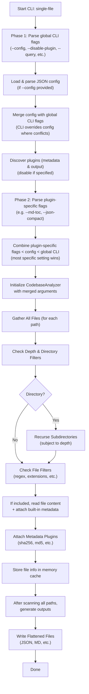

# Single-File

**Transform Your Entire Codebase for Optimal LLM Comprehension and Output**. With a robust feature set, you have full control over the flattening and the ability to enrich your code with crucial metadata. **Single-File** creates outputs that dramatically improve LLM comprehension and response quality.

It is a robust codebase flattening tool designed to unify multiple files and directories into comprehensive, metadata-rich outputs that gives you the control of what your LLM can see. Whether you need simple text flatten for a single folder or an in-depth, multi-output, metadata-filled output for AI ingestion, SingleFile’s modular architecture can adapt to your exact requirements.

- **No External Dependencies**: Built exclusively on the Python Standard Library.  
- **Config-Driven**: Merge a JSON config file with CLI arguments for reproducible setups.  
- **Pluggable**: Add your own output and metadata plugins for specialized needs.  

### LLM Tuned - Smart Context Preservation
- Automatically maintains crucial relationships between files and dependencies.
- Preserves import hierarchies and module structures.
- Includes relevant metadata and hints that help LLMs understand your code better.
<br>
<br>

---

## VS Code Extension

[github:single-file-vsix](https://github.com/chrisdreid/single-file-vsix)<br>
[Code2LLM](https://marketplace.visualstudio.com/items?itemName=corsum.code2llm)

A **Visual Studio Code extension** for SingleFile.

Features
- Global Defaults: Configure your Single-File path, optional Pyenv version, and any additional config root paths.
- Run Dialog: Right-click folders/files (or use the command palette) to open a Run panel where you can:
- Adjust arguments like paths, output, formats, configs and more.
- Quickly Export these arguments as a reusable JSON config.
- Sticky Workspace Settings: The last used arguments are saved per-project so you don’t have to re-enter them.
- Auto-Configuration Prompt: If you haven’t set up Single-File yet, the extension will prompt you to configure it globally on first use.
- Run “Last Settings”: Quickly re-run Single-File with your most recent arguments—no dialog required.

<br>

---
## Acknowledgments

Special thanks to [@VictorHenrique317](https://github.com/VictorHenrique317) for his original work on [flatten-codebase](https://github.com/VictorHenrique317/flatten-codebase.git). SingleFile drew inspiration from flatten-codebase and used it extensively to build this and many other tools.

<br>

---
## Table of Contents

1. [Key Features](#key-features)  
2. [Installation](#installation)  
   - [Linux/macOS](#linuxmacos)  
   - [Windows](#windows)  
   - [Using Pyenv](#using-pyenv)  
3. [Environment Variables](#environment-variables)  
4. [Technical Workflow (Two-Phase CLI)](#technical-workflow-two-phase-cli)  
5. [Basic Usage](#basic-usage)  
   - [A Minimal One-Liner](#a-minimal-one-liner)  
   - [Simple Example with Defaults](#simple-example-with-defaults)  
6. [Intermediate Examples](#intermediate-examples)  
   - [Filtering and Custom Metadata](#filtering-and-custom-metadata)  
   - [Using a JSON Config](#using-a-json-config)  
7. [Advanced Examples](#advanced-examples)  
   - [Multiple Outputs](#multiple-outputs)  
   - [Querying Available Plugins and Configs](#querying-available-plugins-and-configs)  
   - [Mermaid Diagram Example](#mermaid-diagram-example)  
   - [Running from Another Script](#running-from-another-script)  
8. [Plugin Architecture](#plugin-architecture)  
   - [Output Plugins](#output-plugins)  
   - [Metadata Plugins](#metadata-plugins)  
9. [VS Code Extension (Coming Soon)](#vs-code-extension-coming-soon)  
10. [Contributing & Development](#contributing--development)  
11. [License](#license)  

<br>


---
## Key Features
- **Cross-Platform**: Works seamlessly on Windows, macOS, and Linux.
- **Multiple Output Formats**: Built-in support for text (Default), Markdown, and JSON, with the option to create your own output plugins (HTML, CSV, or anything else).
- **Rich Metadata**: Choose from defaults like file size, modification timestamps, or line counts. Extend with MD5 checksums, base64-encoded binary data, or your own custom calculations.
- **Selective Inclusion/Exclusion**: Filter directories, file names, or file extensions with regex patterns for precise scanning.
- **Config-Driven**: Merge a JSON config file with CLI arguments—ideal for reproducible, team-shared workflows.
- **Two-Phase CLI**:
- - **Phase 1** loads global arguments (like `--config` and `--disable-plugin`)
- - **Phase 2** merges your configurations and plugin-specific flags.
- **Error Handling**: Ignore problematic paths or fail early—your choice.

**No External Dependencies**  
SingleFile is proudly built using only the Python Standard Library—no additional third-party packages. This minimalistic approach ensures:
1. **Zero Hassle Installation**: No extra libraries to install or maintain.  
2. **Reduced Conflicts**: Fewer version and compatibility issues.  
3. **Portable and Lightweight**: Straightforward to run on any system with Python 3 installed.  

We believe in providing a lean, self-contained solution that’s easy to integrate into diverse environments.
<br>


---

## Installation

### Linux/macOS

1. **Clone the repository**:
   ```bash
   git clone https://github.com/chrisdreid/single-file.git
   cd single-file
   ```
2. **Install** (editable mode recommended for development or plugin creation):
   ```bash
   pip install -e .
   ```
3. **Test** the installation:
   ```bash
   single-file --help
   ```
   or:
   ```bash
   python -m single-file --help
   ```

### Windows

1. **Clone or download**:
   ```powershell
   git clone https://github.com/chrisdreid/single-file.git
   cd single-file
   ```
2. **Install**:
   ```powershell
   pip install -e .
   ```
3. **Check** everything:
   ```powershell
   single-file --help
   ```
   If `single-file` isn’t recognized, verify your Python scripts directory is on the `PATH`, or use:
   ```powershell
   python -m single-file --help
   ```

### Using Pyenv

If you prefer isolating specific Python versions:

```bash
pyenv install 3.10.5
pyenv shell 3.10.5
pip install -e .
single-file --help
```

<br>

---

## Environment Variables

You can set the `SINGLEFILE_CONFIG_PATH` environment variable to point to one or more directories containing shared JSON config files:

- **macOS/Linux**:
  ```bash
  export SINGLEFILE_CONFIG_PATH="/home/myuser/singlefile_configs"
  ```
- **Windows (PowerShell)**:
  ```powershell
  $Env:SINGLEFILE_CONFIG_PATH = "C:\singlefile_configs"
  ```
- **Windows (cmd.exe)**:
  ```bat
  set SINGLEFILE_CONFIG_PATH=C:\singlefile_configs
  ```

To see which config files SingleFile finds, run:

```bash
single-file --query configs
```

<br>

---

## Technical Workflow (Two-Phase CLI)

SingleFile processes its arguments in **two phases**. A quick overview using **Mermaid**:



**Key Points**:
- **Phase 1** loads top-level flags and merges JSON config if provided.  
- **Plugin Discovery**: SingleFile scans for available output/metadata plugins; any disabled plugins are skipped.  
- **Phase 2** merges the config with final CLI flags (including plugin-specific ones like `--md-toc` or `--json-compact`).  
- SingleFile then scans the codebase, collects metadata, and generates output(s).

<br>

---

## Basic Usage

### Simple Example with Defaults

```bash
single-file \
  --paths ./src \
  --output-file my_project_flat.txt
```

- Scans `./src` recursively with no depth limit.
- Creates one text file: `my_project_flat.txt`.
- **No** advanced filters are applied (default ignore patterns like `.git` still take effect).

<br>

---

## Intermediate Examples

### Filtering and Custom Metadata

```bash
single-file \
  --output-file my-output.json \
  --paths ./my_app \
  --depth 2 \
  --exclude-dirs "^(\\.git|__pycache__)$" \
  --extensions py md \
  --metadata-add md5 \
  --metadata-remove size modified
```

**What’s Happening**:
- Scans `./my_app` **2 levels** deep.
- Excludes `.git` and `__pycache__` directories.
- Only processes `.py` and `.md` files.
- **Adds** MD5 checksums to each file’s metadata (`--metadata-add md5`).
- **Removes** default `size` and `modified` fields from output (`--metadata-remove size modified`).
- Outputs a single file named `my-output.json`.

### Using a JSON Config

```json
// dev_rules.json
{
  "paths": ["./my_app"],
  "exclude_dirs": [".git", "__pycache__"],
  "extensions": ["py", "md", "json"],
  "output_file": "my_app_flat",
  "formats": "markdown"
}
```

Then run:

```bash
single-file --config dev_rules.json --extensions py
```
- Merges settings from `dev_rules.json`.
- CLI override sets `--extensions` to only `.py`.
- Outputs `my_app_flat.md` with code blocks and stats (assuming you also use `--md-stats`).

<br>

---

## Advanced Examples

### Multiple Outputs

```bash
single-file \
  --paths ./my_app \
  --formats default,json \
  --output-file consolidated \
  --ignore-errors
```

- Generates `consolidated.txt` (default text plugin) and `consolidated.json` (JSON plugin).
- **Ignore errors** means any unreadable/permission issues won't crash the process.

### Querying Available Plugins and Configs

```bash
single-file --query formats plugins metadata configs
```

**Returns** (in JSON):
- **formats**: Known output formats (like `default`, `markdown`, `json`).  
- **plugins**: Both output and metadata plugins with descriptions.  
- **metadata**: Default fields and plugin-provided ones (like `md5`, `binary_content`).  
- **configs**: Any config files discovered in `SINGLEFILE_CONFIG_PATH` or `configs/` folder.

### HTML Example Plugin

Want a **visual** representation of your directory tree via HTML? Create a **custom output** plugin (simplified example):

```python
# single-file/plugins/outputs/html_output.py
from single_file.core import OutputPlugin
from pathlib import Path

class HTMLOutputPlugin(OutputPlugin):
    """
    A minimal HTML output plugin for SingleFile.
    Creates a basic HTML page listing files and their content (if included).
    """
    format_name = "html"
    supported_extensions = [".html"]

    def generate_output(self, output_path: Path) -> None:
        """
        Generates an HTML document listing each file path and the file content in <pre> tags.
        """
        try:
            with open(output_path, "w", encoding="utf-8") as f:
                f.write("<!DOCTYPE html>\n<html>\n<head>\n")
                f.write("<meta charset='UTF-8'/>\n")
                f.write("<title>SingleFile HTML Output</title>\n")
                f.write("</head>\n<body>\n")

                f.write("<h1>Project Overview</h1>\n")
                f.write("<ul>\n")

                # Loop through each file we've collected
                for file_info in self.analyzer.file_info_cache.values():
                    filepath = file_info.get("filepath", "unknown")
                    f.write(f"<li><strong>{filepath}</strong></li>\n")

                    # If content is present (and not a skipped binary)
                    content = file_info.get("content", "")
                    f.write("<pre style='border:1px solid #ccc; padding:10px;'>")
                    f.write(content)
                    f.write("</pre>\n")

                f.write("</ul>\n</body>\n</html>\n")

            self.analyzer.logger.info(f"HTML output generated at {output_path}")

        except Exception as e:
            self.analyzer.logger.error(f"Failed to generate HTML output: {e}")
            raise
```

Then:

```bash
single-file --formats html --output-file my-output.html
```

You’ll get a `my-output.html` containing HTML formatted files. From here you can play with it and add metadata or styles as you like.

### Running from Another Script

```python
import subprocess, json

def run_singlefile_query(what="formats"):
    result = subprocess.run(
        ["python", "single-file", "--query", what],
        capture_output=True,
        text=True
    )
    return json.loads(result.stdout)

info = run_singlefile_query("formats")
print("Available output plugins:", info["formats"])
```

<br>

---

## Plugin Architecture

SingleFile is **highly extensible**. You can develop both output plugins (to control how flattened data is written) and metadata plugins (to add fields like checksums or binary data) without modifying the core.

### Output Plugins

Built-in:
- **Default** (`default`, `.txt`): Flatten with text markers around each file’s content.  
- **Markdown** (`markdown`, `.md`): Collapsible sections, table of contents, syntax-highlighted code blocks, etc.  
- **JSON** (`json`, `.json`): A structured JSON representation of your entire codebase.

**Creating Custom Outputs** is as easy as subclassing `OutputPlugin` and implementing `generate_output()`. See the [HTML Example Plugin](#HTMLExamplePlugin) for a demonstration.

### Metadata Plugins

Common built-ins:
- **MD5** (`md5`): Adds an MD5 checksum for each file.  
- **Binary Content** (`binary_content`): Base64-encode if the file is binary.  
- **File Size (Human-Readable)** (`filesize_human_readable`): E.g., “14.2 KB”.

**Create Your Own** by subclassing `MetadataPlugin`:

```python
# single_file/plugins/metadata/myplugin.py
from single_file.plugins.metadata.plugin_base import MetadataPlugin

class MyCustomPlugin(MetadataPlugin):
    metadata_name = "my_field"
    default = False
    description = "Adds a custom field to each file."

    def attach_metadata(self, file_info: dict) -> None:
        file_info["my_field"] = "Hello from the custom plugin!"
```

Enable with:
```bash
single-file --metadata-add my_field
```
<br>


**More Complex Metadata Example** :
```python
# single_file/plugins/metadata/sha256_metadata.py
import hashlib
import os
import logging
from single_file.plugins.metadata.plugin_base import MetadataPlugin

logger = logging.getLogger(__name__)

class SHA256MetadataPlugin(MetadataPlugin):
    """
    A metadata plugin that adds a SHA256 hash for each file.
    """
    metadata_name = "sha256"
    default = False  # Not enabled unless explicitly requested
    description = "SHA256 hash of the file's content."

    def attach_metadata(self, file_info: dict) -> None:
        # Check if this file has 'filepath' and not already flagged as binary-skip, etc.
        # If it does, we can compute the SHA256 hash from disk.
        base_path = self.analyzer.args.paths[0] if self.analyzer.args.paths else "."
        rel_path = file_info.get("filepath", "")
        if rel_path.startswith("./"):
            rel_path = rel_path[2:]  # remove leading "./"

        full_path = os.path.join(base_path, rel_path)

        try:
            with open(full_path, "rb") as f:
                sha256 = hashlib.sha256()
                for chunk in iter(lambda: f.read(4096), b""):
                    sha256.update(chunk)
            file_info["sha256"] = sha256.hexdigest()
        except Exception as e:
            logger.warning(f"Could not compute SHA256 for {full_path}: {e}")
            # Fallback or skip hashing

```

Enable with:
```bash
single-file --metadata-add sha256
```
<br>

---

## Contributing & Development

Contributions are **encouraged**! Here’s how to get started:

1. **Fork** or **clone** this repo.  
2. **Install** in editable mode:
   ```bash
   pip install -e .
   ```
3. **Test** with:
   ```bash
   python -m unittest discover -s tests
   ```
4. Submit **pull requests** to propose features, fix bugs, or enhance docs.

**Potential Contribution Areas**:
- New output plugins (CSV, interactive web viewer, etc.)  
- Advanced metadata plugins (code complexity, language detection)  
- Performance optimizations for large codebases  
- Improved user experience (better CLI error messages, advanced usage docs)

<br>

---

## License

SingleFile is released under the [MIT License](LICENSE). 
Permission is granted to use, modify and distribute this software, provided:
1. The above copyright notice is included
2. Attribution to the original author is maintained
3. A link to https://github.com/chrisdreid/single-file/edit/main/README.md is maintained

See the [LICENSE](LICENSE) file for full terms.

